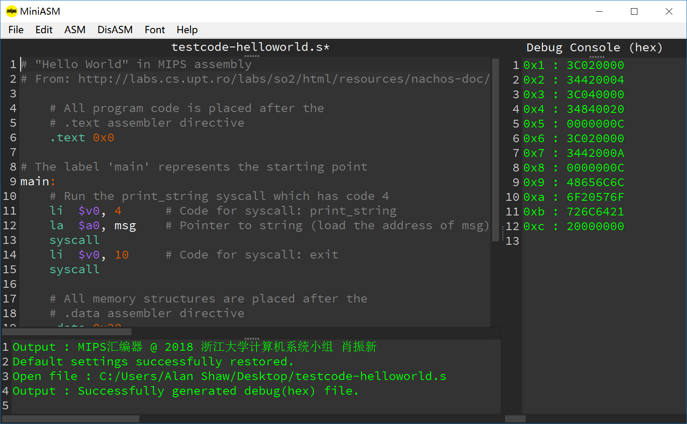

# MIPS 汇编语言编辑器及开发平台

本程序为浙江大学计算机学院计算机组成课程开发，是此课程的一个小作业。

如果发现了软件存在的Bug，请在本项目地址提issue或联系我的邮箱：alanshawzju@gmail.com，本人将十分感谢。

Shortcut:

这是一个耗时不到五天的速成品，白天还在上课，难免有很多问题，为此不做程序的有效性任何担保。

本程序前端采用QT5.10集成开发环境编写，开发语言采用了python3.7。开源代码将在4.30号作业截止日期到达后放在本项目上。

## 主要功能·亮点

###代码编辑功能

- 专为MIPS语言定制的代码高亮显示，行号显示，字体定制。采用仿monokai配色方案，后续将会加入更多的配色。

- 默认有三个窗口：代码编辑窗口，输出窗口和 debug窗口，三个窗口都可以通过拖拽边栏来更改相对大小，也可以拖拽到头来隐藏某个窗口，十分便捷。

- 支持直接推拽进程序窗口加载代码、快速查找，支持基本的代码编辑功能。

- 支持高分辨率显示屏，动态DPI缩放，全屏显示等等。

- 支持更改字体大小、类型甚至是颜色，会自动保存用户的上次打开时的配置，不用每次打开都更改方案，支持一键恢复默认的字体配置，默认字体为source code pro字体，已经随程序默认打包，无需自行下载。

- 代码打包成一个可执行程序文件，已经打包好所有的支持库，在目标平台上可以直接运行，无需任何依赖库。

  ​

### 汇编功能

- 支持基本的MIPS指令转换为机器码的功能，可选的保存格式为coe格式和二进制bin格式。
- 支持Debug功能，并提供debug窗口，实时显示机器码结果。
- 较为完善的错误检查和处理机制，各个子模块错误层级上报。即使遇到未定义的错误，程序也会将错误发生的行号以及相应的python exception内容打印到output窗口，方便纠错。
- 支持MIPS的一百余条指令以及伪指令，指令格式主要参考：《计算机组成与设计：硬件、软件接口》以及《MIPS32® Architecture For Programmers Volume II: The MIPS32® Instruction Set》

## 后续功能

将在之后（可能）加入如下更多功能：

- 支持从coe和bin文件的反汇编功能（一定会加）
- 自定义代码配色
- 加入更多的代码配色方案
- 修补各种bug

## 版权所有

